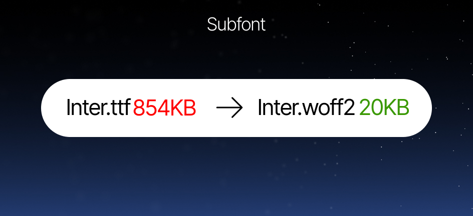

<a id="readme-top"></a>



<br />
<div align="center">
  <h3 align="center">Subfont - Ultra-optimized font subsetting for Astro</h3>
  <p align="center">
    Automatically subset, compress, and optimize your local fonts - dramatically smaller font files, faster paint times, better Lighthouse scores.
    <br />
    <br />
    <a href="https://github.com/forthgoing/subfont"><strong>Explore the docs</strong></a>
    <br />
    <br />
    <a href="https://github.com/forthgoing/subfont/issues/new?labels=bug&template=bug-report.md">Report Bug</a>
    ·
    <a href="https://github.com/forthgoing/subfont/issues/new?labels=enhancement&template=feature-request.md">Request Feature</a>
  </p>
</div>

<div align="center">

[](https://www.npmjs.com/package/@forthgoing/subfont)
[](https://astro.build)
[](https://opensource.org/licenses/MIT)
[](https://github.com/forthgoing/subfont)

</div>

<!-- TABLE OF CONTENTS -->
<details>
  <summary>Table of Contents</summary>
  <ol>
    <li><a href="#about-the-project">About The Project</a></li>
    <li><a href="#key-features">Key Features</a></li>
    <li><a href="#what-makes-it-stand-out">What Makes It Stand Out</a></li>
    <li><a href="#getting-started">Getting Started</a>
      <ul>
        <li><a href="#prerequisites">Prerequisites</a></li>
        <li><a href="#installation">Installation</a></li>
      </ul>
    </li>
    <li><a href="#usage">Usage</a></li>
    <li><a href="#configuration">Configuration</a></li>
    <li><a href="#how-it-works">How It Works</a></li>
    <li><a href="#contributing">Contributing</a></li>
    <li><a href="#license">License</a></li>
  </ol>
</details>

## About The Project

**Subfont** is a powerful **Astro integration** that takes your local fonts (TTF, OTF, WOFF2) in `/src/assets/fonts`, analyzes **all actual text content** across your `.astro`, `.md`, `.mdx`, `.ts`, etc. files, and generates **WOFF2 subsets** with only the text you use.

The result? Fonts that are **often 70-95% smaller** than the originals, with zero visual difference, leading to faster page loads, lower data usage (especially on mobile), improved **Largest Contentful Paint (LCP)**, and significantly better **Lighthouse / Core Web Vitals** scores.

<p align="right">(<a href="#readme-top">back to top</a>)</p>

### Key Features

- **Only includes glyphs actually used in your site**
- **Automatic WOFF2 conversion & compression** (TTF/OTF → highly optimized WOFF2)
- **Original font source files** - Keeps your original fonts saved so when you use more characters in your site it automatically gets added to the optimized fonts.
- **Variable font support**
- **Smart caching** - only re-processes changed fonts or when content changes
- **Font manifest generation**
- **Full control of your fonts** Preload, display, alias, etc..
- **Duplicate & symlink protection**

### What Makes Subfont Stand Out

Most font optimization tools either:

- Require manual unicode-range lists
- Depend on Google Fonts / external services
- Don't update subsets when content changes
- Rely on bloated python scripts or wrappers like `glyphhanger`

**@forthgoing/subfont** stands out because it:

- **Core fully built in Rust**.
- **Fast and lightweight**
- **Fully configurable**
- **Keeps your original font files for updating your optimized fonts**
- **Doesn't require installing anything extra**
- **Caches intelligently using content hash + font hash + version**

<p align="right">(<a href="#readme-top">back to top</a>)</p>

## Getting Started

### Prerequisites

Requires:

- Node 18+
- Astro 4+
- Fonts in `/src/assets/fonts`

Supported source formats:

- `.ttf`
- `.otf`
- `.woff2`

WOFF is not supported and will be skipped gracefully.

---

## Installation

1. Add the dependency:

```sh
npm install @forthgoing/subfont
# or
pnpm add @forthgoing/subfont
# or
yarn add @forthgoing/subfont
```

2. Add the plugin to `astro.config.(ts|js|mjs)`:

```typescript
import subfont from "@forthgoing/subfont";

export default defineConfig({
  integrations: [subfont()],
});
```

3. Import tags into your `Layout.astro`:

```javascript
import SubfontHead from "forthgoing:subfont/head";
import SubfontBody from "forthgoing:subfont/body";
```

Usage inside `Layout.astro`:

```html
<head>
  <meta charset="utf-8" />
  <SubfontHead />
  <!--- other head content--->
</head>
<body>
  <SubfontBody />
  ...
</body>
```

4. Place your fonts in `src/assets/fonts`:

```
src/assets/fonts/
├── Inter-Regular.ttf
├── Inter-Italic.ttf
├── PragmataPro.woff2
└── MyCustomFont-Variable.ttf
```

## Usage

After setup, just run `npm run dev` or `npm run build`

And use your font normally:

```
h1 {
    font-family: 'InterRegular',
}
```

## Configuration

### Subfont config `subfont.config.ts`

Create this file at the root of your project.

```typescript

import type { SubfontConfig } from "@forthgoing/subfont";

const config: SubfontConfig = {
  inter: {
    alias: "Inter",
    display: "swap",
    weight: "100 900",
    tagPlacement: "head",      // "head" | "body"
    stylePlacement: "head",
    preload: true,
  },
  pragma: {
    tagPlacement: "head",
    weight: "100 900",
    stylePlacement: "head",
  },
  // Add more font families...
};

export default config;

```

### Plugin options `astro.config.ts`

```typescript
subfont({
  assetsFolder: "src/assets",      // default
  fontsSubdir: "fonts",            // default = "fonts"
  hashFonts: true,                 // append content hash to filename (great for caching)
})
```

## How it works

1. Scans all source files and collects used characters
2. Computes content hash
3. For each font:

- Checks cache
- Subsets to only used glyphs
- Converts to WOFF2
- Keeps your original fonts
- Removes old variants

4. Injects `<link rel="preload">`, `@font-face` via SubfontHead / SubfontBody

## Contributing

Contributions are welcome!

1. Fork the project
2. Create your feature branch
3. Commit your changes
4. Push to the branch
5. Open a pull request

## License

Distributed under the MIT License. See `LICENSE` for more information.
